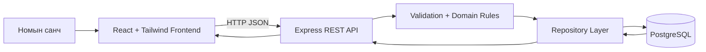

# Архитектур

## Ерөнхий тойм

Систем нь React frontend, Express REST API, PostgreSQL өгөгдлийн сан гэсэн сонгодог гурван давхар web архитектур ашиглана. Зээлэх боломж болон хугацаа хэтэрсэн төлөвийн бизнес дүрмүүдийг UI кодоос тусгаарласан тул шууд тестлэх боломжтой.

## Module-ууд

- Frontend app: dashboard, inventory table, members, loans, search/filter controls
- REST API: books, members, loans, dashboard summary route-ууд
- Domain rules: copy тоо, loan creation, return flow, overdue status-ыг validate хийнэ
- Database layer: PostgreSQL table-ууд болон parameterized query

## Өгөгдлийн урсгал

1. Номын санч inventory хайх эсвэл зээлэлт эхлүүлнэ.
2. React нь Express API руу JSON request илгээнэ.
3. API input-ыг шалгаад domain rule-үүдийг дуудна.
4. Repository PostgreSQL record унших эсвэл бичих үйлдэл хийнэ.
5. API шинэчлэгдсэн төлөвтэй JSON response буцаана.
