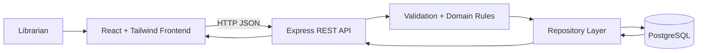

# Architecture

## Overview

The system uses a classic three-layer web architecture: React frontend, Express REST API, and PostgreSQL database. Business rules for loan availability and overdue status are kept separate from UI code so they can be tested directly.

## Modules

- Frontend app: dashboard, inventory table, members, loans, search/filter controls
- REST API: routes for books, members, loans, dashboard summary
- Domain rules: validates copies, loan creation, return flow, overdue status
- Database layer: PostgreSQL tables and parameterized queries

## Data Flow

1. Librarian searches inventory or starts a loan.
2. React sends JSON request to the Express API.
3. API validates input and calls domain rules.
4. Repository reads or writes PostgreSQL records.
5. API returns a JSON response with updated state.
